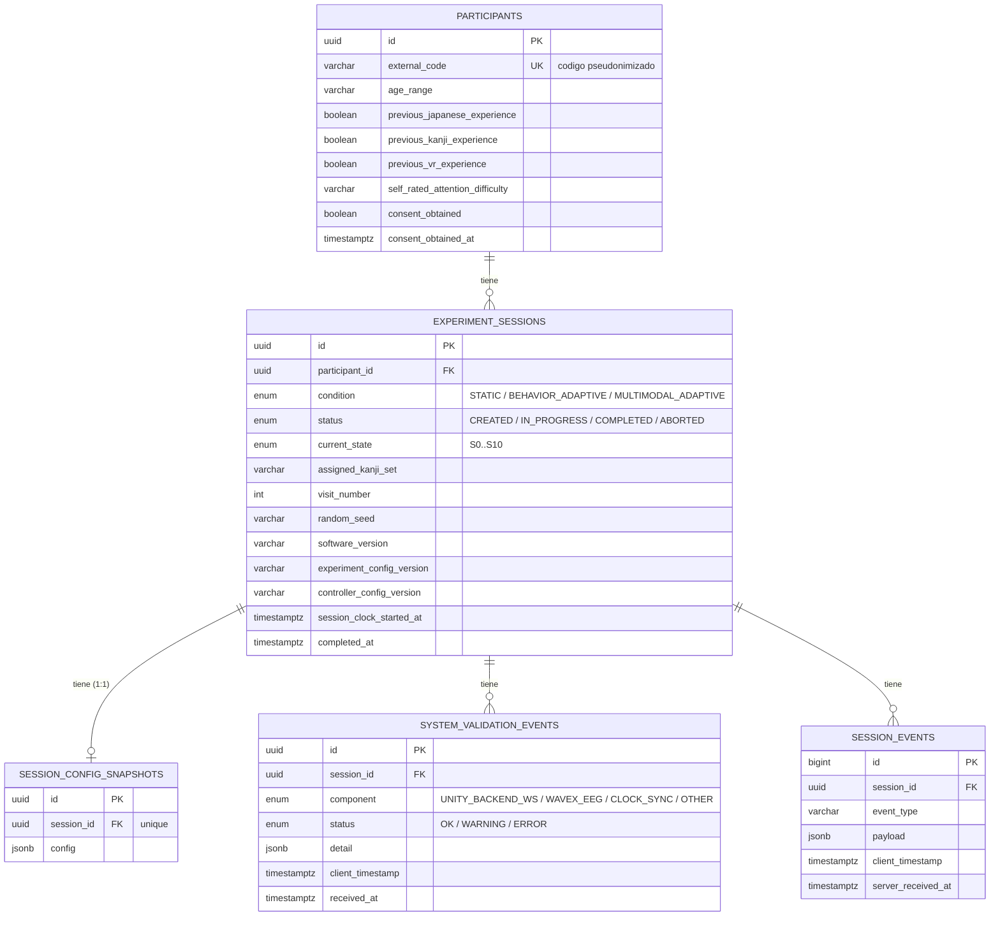

# Esquema PostgreSQL inicial — Fase 1

Diagrama entidad-relación del esquema fundacional. Ver `schema.sql`
para el DDL completo y `backend/alembic/versions/0001_initial_schema.py`
para la migración equivalente (ambos fueron verificados aplicándolos
contra una instancia real de PostgreSQL 16 — ver nota al final).

## Por qué este alcance y no más

Este es el esquema **fundacional de Fase 1** (Foundation & Feasibility,
W1–W2), no el "PostgreSQL schema v1" completo que el anteproyecto
apunta como entregable de M2 (25 sep 2026). La diferencia es
deliberada:

| Ya modelado (Fase 1) | Llega en fases posteriores |
|---|---|
| Participante + screening básico | `KanjiLearningItem` completo (contenido, assembly, pools) → **Fase 2** |
| Sesión + condición + config snapshot | Trial data contract completo (T1/T2/T3, spec §11) → **Fase 2–3** |
| Validación técnica genérica (WS, WAVEX, clock) | EEG windows sincronizadas con WAVEX Adapter → **Fase 4** |
| Event log genérico | Vocabulario conductual completo (`HEAD_AWAY`, `HINT_REQUESTED`, etc., spec §11.1) → **Fase 3** |
| — | Adaptation events (ESL/LAL, explainability log) → **Fase 5** |
| — | Outcome Evaluator / Adaptive Learner Profile → **Fase 6** |

Las tablas de Fase 1 ya dejan el terreno preparado: cualquier tabla
nueva de las fases siguientes se cuelga de `experiment_sessions` (FK +
`ON DELETE CASCADE`), y `config` / `detail` / `payload` son JSONB
precisamente porque varios parámetros siguen marcados "to validate" en
la especificación (thresholds del State Estimator, calidad EEG,
ventana de observación, cooldown) — no tiene sentido congelar columnas
relacionales para valores que todavía dependen de datos piloto.

## Verificación realizada

Este entorno no tiene salida a internet para instalar las dependencias
Python del backend (pip a PyPI está bloqueado), así que no se pudo
correr `alembic upgrade head` end-to-end acá. En su lugar, se verificó
el **DDL equivalente** (`schema.sql`) contra una instancia real de
PostgreSQL 16 levantada en este mismo entorno:

- Las 5 tablas + 5 enums se crean sin errores.
- Insert de participante → sesión → config snapshot → evento →
  validation event, y un `JOIN` de las 5 tablas devuelve los datos
  correctamente (tipos JSONB y enum incluidos).
- `DELETE` de un participante borra en cascada la sesión y sus eventos
  asociados (confirma `ON DELETE CASCADE`).

La migración de Alembic (`0001_initial_schema.py`) se escribió a mano
para producir exactamente este DDL verificado — con `alembic` instalado
en tu máquina, `alembic upgrade head` debería reproducirlo
1:1. Vale la pena confirmarlo como primer paso al levantar el proyecto
localmente (ver `backend/README.md`, sección Verificación).
