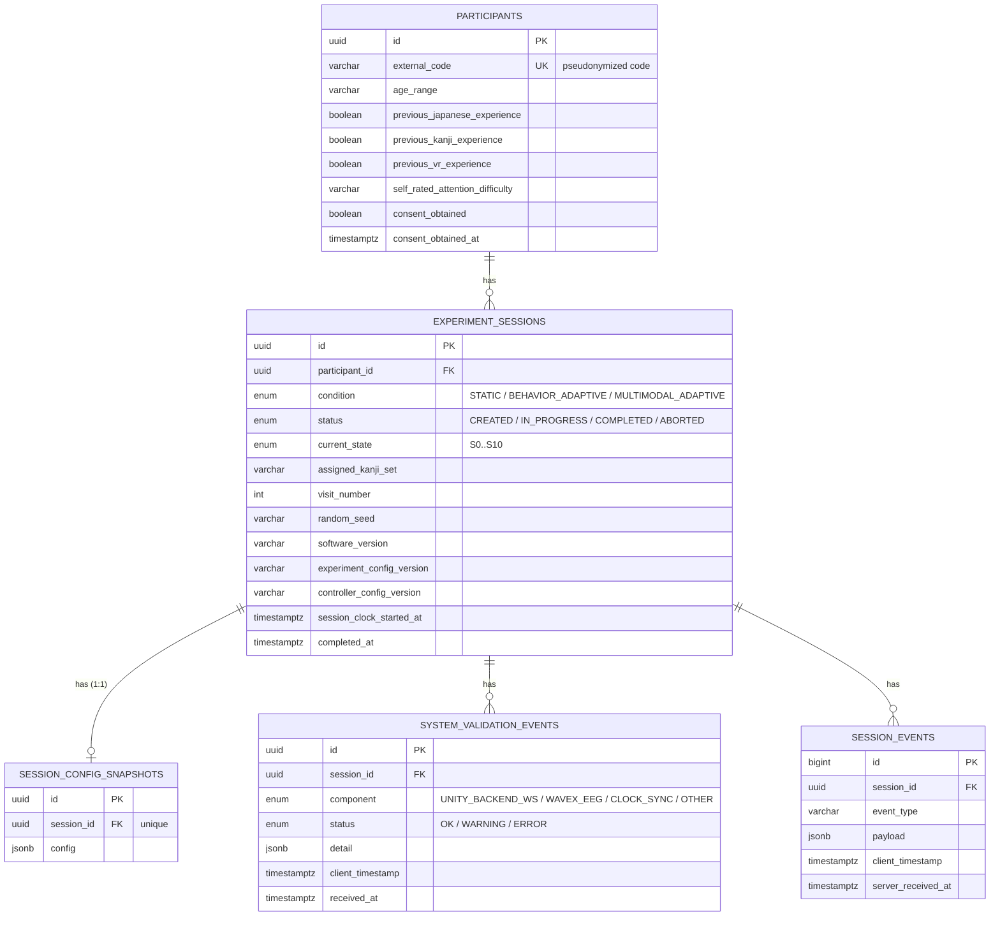

# Initial PostgreSQL schema — Phase 1

Entity-relationship diagram of the foundational schema. See `schema.sql`
for the full DDL and `backend/alembic/versions/0001_initial_schema.py`
for the equivalent migration; the two must be kept identical.

## Why this scope and no more

This is the **Phase 1 foundational schema** (Foundation & Feasibility,
W1–W2), not the complete "PostgreSQL schema v1" that the project proposal
assigns to M2 (25 Sep 2026). The difference is deliberate:

| Already modeled (Phase 1) | Arrives in later phases |
|---|---|
| Participant + basic screening | Full `KanjiLearningItem` (content, assembly, pools) → **Phase 2** |
| Session + condition + config snapshot | Full trial data contract (T1/T2/T3, spec §11) → **Phase 2–3** |
| Generic technical validation (WS, WAVEX, clock) | EEG windows synchronized through the WAVEX Adapter → **Phase 4** |
| Generic event log | Full behavioral vocabulary (`HEAD_AWAY`, `HINT_REQUESTED`, etc., spec §11.1) → **Phase 3** |
| — | Adaptation events (ESL/LAL, explainability log) → **Phase 5** |
| — | Outcome Evaluator / Adaptive Learner Profile → **Phase 6** |

The Phase 1 tables already prepare the ground: any new table in the
following phases hangs off `experiment_sessions` (FK + `ON DELETE
CASCADE`), and `config` / `detail` / `payload` are JSONB precisely because
several parameters remain marked "to validate" in the specification
(State Estimator thresholds, EEG quality, observation window, cooldown).
Freezing relational columns for values that still depend on pilot data
makes no sense.

## How Phase 2 uses this schema without changing it

`session_events` has `event_type VARCHAR(64)` plus `payload JSONB`, both
indexed, so it absorbs any new event without a migration. Phase 2 emits
all of its behavioral telemetry through that generic log and **ships no
Alembic migration**; Phase 3 promotes those events into relational tables
once the vocabulary has been stabilized by real use, designing schema v1
against payloads that already exist in the database rather than against a
specification on paper.

The operational rule that makes this work: every event Phase 2 emits must
carry in its payload the identifiers Phase 3 will need as foreign keys —
`kanji_id`, `trial_id`, `trial_type`, `trial_sequence` — even though
nothing consumes them yet. An event emitted without them is an event
Phase 3 cannot migrate.

## Two columns that are projections, not sources of truth

`current_state` and `status` on `experiment_sessions` describe where a
session is; the authoritative history is the event log.

`current_state` is updated by the WebSocket handler whenever a
`STATE_ENTERED` arrives. Until 7 September 2026 nothing updated it, and
every session read `S0_SESSION_INITIALIZATION` regardless of how far it had
actually progressed — including one with events through S9.

`status` still has that problem: it reads `CREATED` on sessions that
reached S9. Fixing it properly requires knowing when a session completed or
was aborted, which arrives with the Phase 2 flow work.

## Verification performed

The DDL in `schema.sql` was verified by applying it against a real
PostgreSQL 16 instance:

- The 5 tables and 5 enums are created without errors.
- Inserting participant → session → config snapshot → event → validation
  event, then `JOIN`ing all five tables, returns the data correctly
  (JSONB and enum types included).
- `DELETE`ing a participant cascades to the session and its associated
  events, confirming `ON DELETE CASCADE`.

The Alembic migration (`0001_initial_schema.py`) was hand-written to
produce exactly that verified DDL. It has since been applied for real:
`alembic upgrade head` runs in the Docker environment and the four backend
tests pass against the resulting database.

`verify_m1.sql` holds the milestone verification queries and runs clean
against this schema. Two bugs in it were fixed on 7 September 2026: it
referenced a `server_timestamp` column that never existed (the real name is
`server_received_at`), and it computed the clock offset with
`EXTRACT(MILLISECOND FROM ...)`, which returns only the seconds-and-
milliseconds field of an interval and silently discards minutes — a
1 min 200 ms offset was reported as 200. It now uses
`EXTRACT(EPOCH FROM ...) * 1000`.
