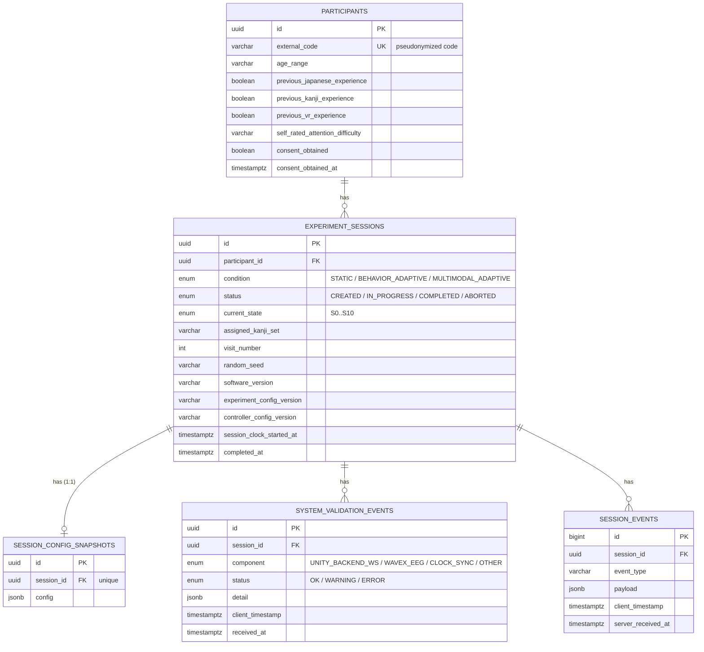
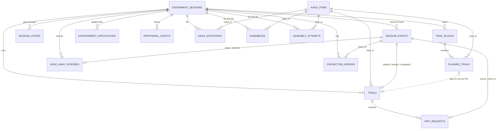

# PostgreSQL schema — Phase 1 + schema v1 (Phase 3)

Entity-relationship diagrams of the foundational schema (migration 0001) and
of schema v1 (migration 0002, F3.4, [below](#schema-v1--phase-3-migration-0002)).
See `schema.sql` for the full DDL and `backend/alembic/versions/` for the
equivalent migrations; they must be kept identical.

```mermaid
erDiagram
    PARTICIPANTS ||--o{ EXPERIMENT_SESSIONS : "has"
    EXPERIMENT_SESSIONS ||--o| SESSION_CONFIG_SNAPSHOTS : "has (1:1)"
    EXPERIMENT_SESSIONS ||--o{ SYSTEM_VALIDATION_EVENTS : "has"
    EXPERIMENT_SESSIONS ||--o{ SESSION_EVENTS : "has"

    PARTICIPANTS {
        uuid id PK
        varchar external_code UK "pseudonymized code"
        varchar age_range
        boolean previous_japanese_experience
        boolean previous_kanji_experience
        boolean previous_vr_experience
        varchar self_rated_attention_difficulty
        boolean consent_obtained
        timestamptz consent_obtained_at
    }

    EXPERIMENT_SESSIONS {
        uuid id PK
        uuid participant_id FK
        enum condition "STATIC / BEHAVIOR_ADAPTIVE / MULTIMODAL_ADAPTIVE"
        enum status "CREATED / IN_PROGRESS / COMPLETED / ABORTED"
        enum current_state "S0..S10"
        varchar assigned_kanji_set
        int visit_number
        varchar random_seed
        varchar software_version
        varchar experiment_config_version
        varchar controller_config_version
        timestamptz session_clock_started_at
        timestamptz completed_at
    }

    SESSION_CONFIG_SNAPSHOTS {
        uuid id PK
        uuid session_id FK "unique"
        jsonb config
    }

    SYSTEM_VALIDATION_EVENTS {
        uuid id PK
        uuid session_id FK
        enum component "UNITY_BACKEND_WS / WAVEX_EEG / CLOCK_SYNC / OTHER"
        enum status "OK / WARNING / ERROR"
        jsonb detail
        timestamptz client_timestamp
        timestamptz received_at
    }

    SESSION_EVENTS {
        bigint id PK
        uuid session_id FK
        varchar event_type
        jsonb payload
        timestamptz client_timestamp
        timestamptz server_received_at
    }
```

## Why this scope and no more

This is the **Phase 1 foundational schema** (Foundation & Feasibility,
W1–W2), not the complete "PostgreSQL schema v1" that the project proposal
assigns to M2 (25 Sep 2026). The difference is deliberate:

| Already modeled (Phase 1) | Arrives in later phases |
|---|---|
| Participant + basic screening | Full `KanjiLearningItem` (content, assembly, pools) → **Phase 2** |
| Session + condition + config snapshot | Full trial data contract (T1/T2/T3, spec §11) → **Phase 2–3** |
| Generic technical validation (WS, WAVEX, clock) | EEG windows synchronized through the WAVEX Adapter → **Phase 4** |
| Generic event log | Full behavioral vocabulary (`HEAD_AWAY`, `HINT_REQUESTED`, etc., spec §11.1) → **Phase 3** |
| — | Adaptation events (ESL/LAL, explainability log) → **Phase 5** |
| — | Outcome Evaluator / Adaptive Learner Profile → **Phase 6** |

The Phase 1 tables already prepare the ground: any new table in the
following phases hangs off `experiment_sessions` (FK + `ON DELETE
CASCADE`), and `config` / `detail` / `payload` are JSONB precisely because
several parameters remain marked "to validate" in the specification
(State Estimator thresholds, EEG quality, observation window, cooldown).
Freezing relational columns for values that still depend on pilot data
makes no sense.

## How Phase 2 uses this schema without changing it

`session_events` has `event_type VARCHAR(64)` plus `payload JSONB`, both
indexed, so it absorbs any new event without a migration. Phase 2 emits
all of its behavioral telemetry through that generic log and **ships no
Alembic migration**; Phase 3 promotes those events into relational tables
once the vocabulary has been stabilized by real use, designing schema v1
against payloads that already exist in the database rather than against a
specification on paper.

The operational rule that makes this work: every event Phase 2 emits must
carry in its payload the identifiers Phase 3 will need as foreign keys —
`kanji_id`, `trial_id`, `trial_type`, `trial_sequence` — even though
nothing consumes them yet. An event emitted without them is an event
Phase 3 cannot migrate.

## Two columns that are projections, not sources of truth

`current_state` and `status` on `experiment_sessions` describe where a
session is; the authoritative history is the event log.

`current_state` is updated by the WebSocket handler whenever a
`STATE_ENTERED` arrives. Until 7 September 2026 nothing updated it, and
every session read `S0_SESSION_INITIALIZATION` regardless of how far it had
actually progressed — including one with events through S9.

`status` still has that problem: it reads `CREATED` on sessions that
reached S9. Fixing it properly requires knowing when a session completed or
was aborted, which arrives with the Phase 2 flow work.

## Verification performed

The DDL in `schema.sql` was verified by applying it against a real
PostgreSQL 16 instance:

- The 5 tables and 5 enums are created without errors.
- Inserting participant → session → config snapshot → event → validation
  event, then `JOIN`ing all five tables, returns the data correctly
  (JSONB and enum types included).
- `DELETE`ing a participant cascades to the session and its associated
  events, confirming `ON DELETE CASCADE`.

The Alembic migration (`0001_initial_schema.py`) was hand-written to
produce exactly that verified DDL. It has since been applied for real:
`alembic upgrade head` runs in the Docker environment and the four backend
tests pass against the resulting database.

`verify_m1.sql` holds the milestone verification queries and runs clean
against this schema. Two bugs in it were fixed on 7 September 2026: it
referenced a `server_timestamp` column that never existed (the real name is
`server_received_at`), and it computed the clock offset with
`EXTRACT(MILLISECOND FROM ...)`, which returns only the seconds-and-
milliseconds field of an interval and silently discards minutes — a
1 min 200 ms offset was reported as 200. It now uses
`EXTRACT(EPOCH FROM ...) * 1000`.

## Schema v1 — Phase 3, migration 0002

Added on 1 October 2026 (F3.4). Design and reasons: `MER_Schema_v1.md` in the
project docs. The five Phase 1 tables do not change; `session_events` gains one
expression index on `payload->>'trial_id'`.

**`session_events` stays the source of truth.** Every table below except
`kanji_items` is a projection of it, rebuilt by `project_session(session_id)`
and kept current by `project_event(event_id)`, which the backend calls after
storing each event. Both are PL/pgSQL, in the migration, so the backend, the
backfill (`backfill_projection.sql`) and pgAdmin run the same code. A row
always keeps the id of the event it came from; a failure never loses the event
and is logged in `projection_errors`. `verify_projection.sql` checks tables
against events.

`kanji_items` is reference data, seeded by `seed_kanji_items.sql`, which
`tools/kanji_seed_sql.py` generates from `kanji_content.json` (and
`tools/kanji_metrics.py --export` regenerates with it).

```mermaid
erDiagram
    EXPERIMENT_SESSIONS ||--o{ SESSION_EVENTS : "source of truth"
    EXPERIMENT_SESSIONS ||--o{ SESSION_STATES : "goes through"
    EXPERIMENT_SESSIONS ||--o{ TRIAL_BLOCKS : "plans"
    TRIAL_BLOCKS ||--|{ PLANNED_TRIALS : "contains"
    EXPERIMENT_SESSIONS ||--o{ TRIALS : "runs"
    TRIALS ||--o{ HINT_REQUESTS : "receives"
    EXPERIMENT_SESSIONS ||--o{ ENVIRONMENT_APPLICATIONS : "applies ESL"
    EXPERIMENT_SESSIONS ||--o{ PERIPHERAL_EVENTS : "shows"
    EXPERIMENT_SESSIONS ||--o{ HEAD_AWAY_EPISODES : "records"
    EXPERIMENT_SESSIONS ||--o{ KANJI_EXPOSURES : "S5"
    EXPERIMENT_SESSIONS ||--o{ ASSEMBLIES : "S2 and S5"
    EXPERIMENT_SESSIONS ||--o{ ASSEMBLY_ATTEMPTS : "S2 and S5"
    EXPERIMENT_SESSIONS ||--o{ PROJECTION_ERRORS : "log"
    KANJI_ITEMS ||--o{ PLANNED_TRIALS : "kanji_id"
    KANJI_ITEMS ||--o{ TRIALS : "kanji_id"
    KANJI_ITEMS ||--o{ KANJI_EXPOSURES : "kanji_id"
    KANJI_ITEMS ||--o{ ASSEMBLIES : "kanji_id"
    KANJI_ITEMS ||--o{ ASSEMBLY_ATTEMPTS : "kanji_id"
    SESSION_EVENTS ||--o| TRIALS : "started / answer / completed"
    SESSION_EVENTS ||--o| HINT_REQUESTS : "source_event_id"
    SESSION_EVENTS ||--o| HEAD_AWAY_EPISODES : "away / returned"
    SESSION_EVENTS ||--o{ PROJECTION_ERRORS : "event_id"
    PLANNED_TRIALS |o..o| TRIALS : "plan vs run (no FK)"
```

| Table | From event(s) | Key |
|---|---|---|
| `kanji_items` | — (seed) | `kanji_id` |
| `session_states` | `STATE_ENTERED` | `(session_id, visit_seq)` |
| `trial_blocks` | `TRIAL_SEQUENCE_GENERATED` | `(session_id, block_state)` |
| `planned_trials` | each entry of `sequence` | `(session_id, trial_id)` |
| `trials` | `TRIAL_STARTED` creates; `ANSWER_SELECTED`, `TRIAL_COMPLETED` fill in | `(session_id, trial_id)` |
| `hint_requests` | `HINT_REQUESTED` | `source_event_id` |
| `environment_applications` | `ENVIRONMENT_APPLIED` | `source_event_id` |
| `peripheral_events` | `PERIPHERAL_EVENT` | `source_event_id` |
| `head_away_episodes` | `HEAD_AWAY` creates; `HEAD_RETURNED` closes | `(session_id, episode)` |
| `kanji_exposures` | `KANJI_EXPOSED` | `source_event_id` |
| `assemblies` | `ASSEMBLY_COMPLETED` | `(session_id, exposure_index)` |
| `assembly_attempts` | `ASSEMBLY_SEGMENT_PLACED` | `source_event_id` |
| `projection_errors` | failures of `project_event` | `id` |

Derived, not stored: `v_environment_intervals` (validity of each ESL
application), `v_trial_behavior` (head-away time in each trial's response
window, peripheral events in the whole trial) and `trial_timeline(session_id,
window_n DEFAULT 3)`, one row per trial with the observation-window aggregates
the F5a State Estimator reads.
